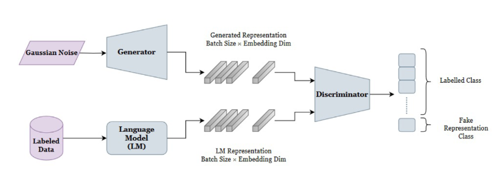
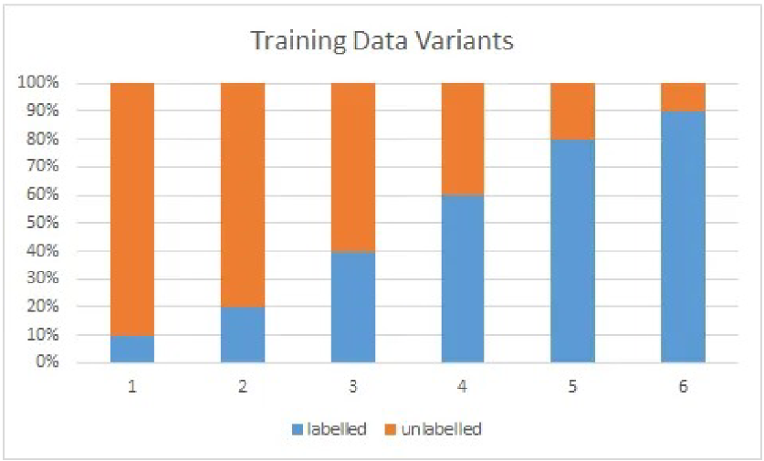
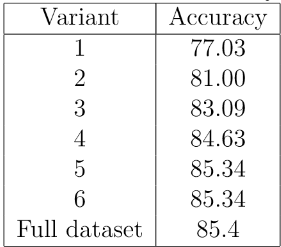

# GAN-BERT

* Implemented GAN-BERT model for semi-supervised intent classification in the Chinese language.
* Enhanced classification accuracy by leveraging unlabeled data with generative adversarial networks (GANs).
* Achieved improved intent detection performance with limited labeled data, supporting resource-constrained NLP applications.
* Fine-tuned BERT to handle specific intent classification tasks, integrating GAN-based semi-supervised learning techniques.

Architecture

Results

