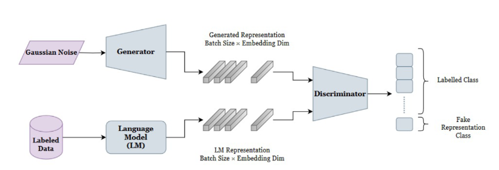
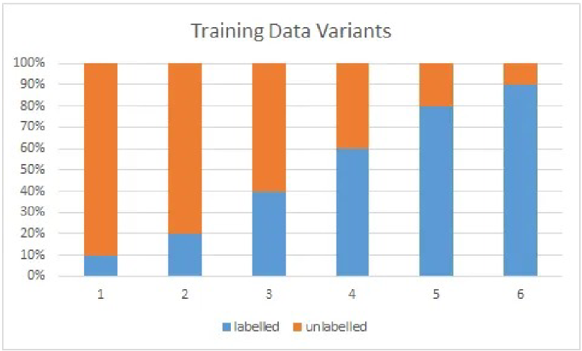
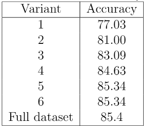

# GAN-BERT

This project explores the application of semi-supervised learning for intent classification in the Chinese language using a GAN-BERT architecture. As chatbot and virtual assistant technologies become increasingly prominent, accurately identifying user intent becomes a critical component of effective natural language understanding systems. However, intent classification typically relies on large, labeled datasets, which are often costly and time-consuming to collect—especially in low-resource languages like Chinese. To address this, we implement a semi-supervised framework that leverages both labeled and unlabeled data.

Our approach integrates a pre-trained BERT-based language model with a Generative Adversarial Network (GAN), allowing the system to benefit from the robust contextual representations offered by BERT while reducing its dependency on large labeled corpora through adversarial learning. The generator synthesizes intent-related embeddings from noise, while the discriminator classifies both real and generated samples, distinguishing not only between real and fake data but also identifying the correct intent class for real inputs.

### Architecture

* Language Model: Pretrained BERT-base-Chinese model (12 layers, 768 hidden units, 12 heads).
* Generator: Produces fake embeddings from Gaussian noise, passed through LeakyReLU and dropout layers.
* Discriminator: Classifies inputs as real/fake and predicts intent (for real samples).

### Results

* Achieves 77.03% accuracy using only 10% labeled data.
* Maximum accuracy of 85.34%, nearly matching the full-supervised model (85.4%).
* Shows robustness and generalization with minimal labeled supervision.

